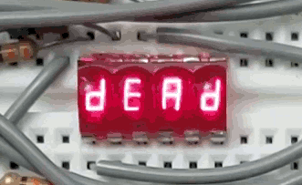
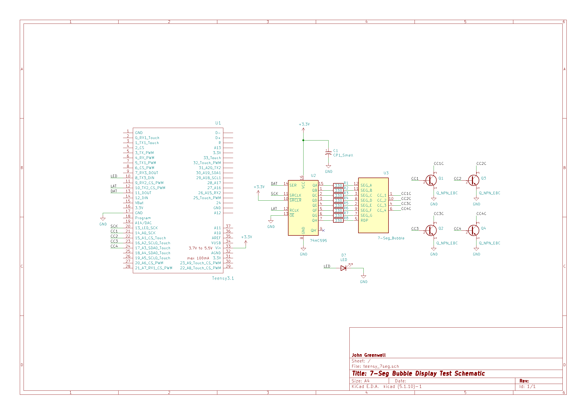
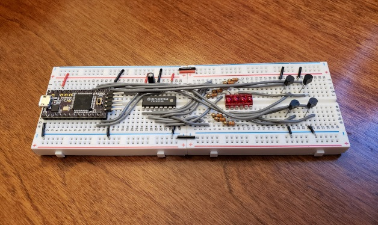

# Micro Numeric Display Project

Print data to 7-segment micro-numeric indicator chip with Teensy microcontroller

## Overview

The included custom library *micro7seg.h* provides Arduino framework support for controlling [QDSP-6064](https://www.sparkfun.com/products/retired/12710) micro-numeric indicator chips.



The library is designed for flexibility with respect to intermediate stages of circuitry driving the chip. In this example project, the chip is driven using a [74HC595 8-bit Shift Register](https://www.digikey.com/en/products/detail/texas-instruments/SN74HC595N/277246) and four [2N3904 NPN transistors](https://www.digikey.com/en/products/detail/rochester-electronics-llc/2N3904/11554806).

## Code

Using the library, the micro-numeric indicator chip is accessed with the *print( )* method. The operation shown above is the result of example code:

```cpp
display.print("dead");
delay(500);
display.print("beef");
delay(500);
for (uint16_t i = 0; i < 0xFFFF; i++) {
    display.print(i);
    delay(50);
}
```

Printing of character strings extends to printing the symbol '-', and also use of '.' to illuminate built-in decimal point for each digit of the display.

Initilization of the class requires an array of pointers to three user-defined functions which define IO setup, IO pin arrangement relative to each segment of each digit, and IO selection of each digit. Specific details regarding these function formats are included in *micro7seg.h*.

```cpp
void (*micro7SegIOBind[3])(uint8_t) = {
    &micro7SegBegin,
    &micro7SegLatchData,
    &micro7SegCCSelect
};
```

This way, the class is abstracted from any custom circuitry intended for driving the chip, and is not limited to the circuit schematic used in this example. 

## Schematic

The schematic for this project and associated CAD files are included as composed in KiCad 5.



This is implemented in breadboarded format, using the Teensy 3.1 microcontroller.



## License

MIT © 2021 John Greenwell